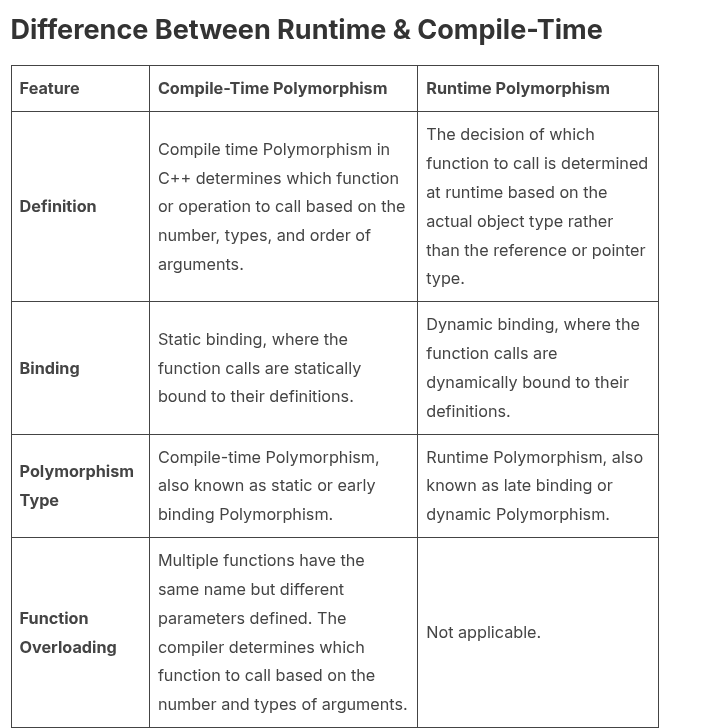
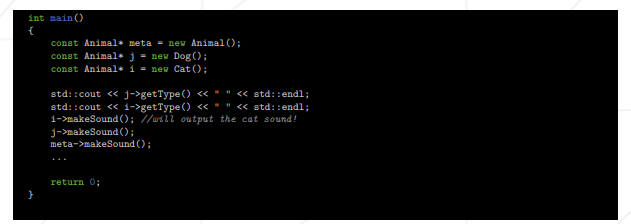

# Cpp Module 04

### Created by:
**`    sboukiou  (Said)`**

#### Subtype Polymorphism, Abstract Classes, and Interfaces

## Core Concepts:
### Polymorphism:
**:book: [Polymorphism In General](https://www.geeksforgeeks.org/cpp/cpp-polymorphism)**\
**:book: [More about dynamic Polymorphism](https://www.mygreatlearning.com/blog/polymorphism-in-cpp/)**

\
    ***Or in simple terms:***
```
    * Static Polymorphism: Functions/Operators overload during compile time
    * Dynamic Polymorphism: Function override && virtual Functions (C++11)

```


**:book: [Usage of virtual functions](https://cplusplus.com/doc/tutorial/polymorphism/)**\
**:book: [More about Vf](https://en.cppreference.com/w/cpp/language/virtual.html)**\
***Like in this situation , which makeSound() version is called ?***


